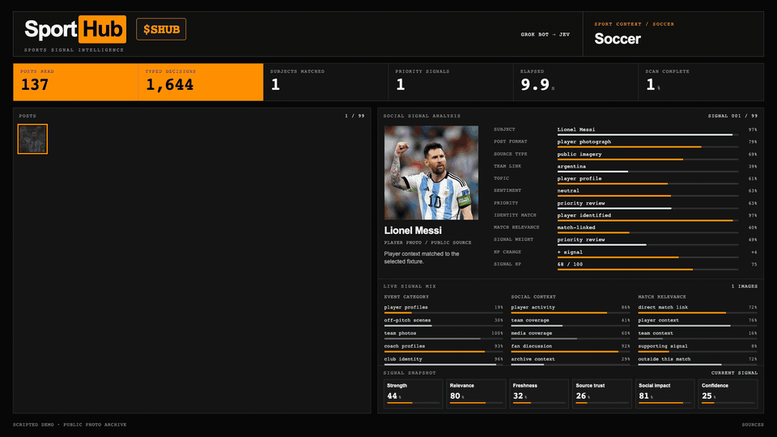

<p align="center">
  <a href="https://sporthub.sh"></a>
</p>

<p align="center">
  <a href="https://sporthub.sh/api/health"></a>
  <a href="https://sporthub.sh/api/health"></a>
  <a href="openapi.yaml"></a>
  
  
</p>

[Website](https://sporthub.sh) · [X](https://x.com/iamigorekk)

> **$SHUB · contract address**
>
> ```text
> Coming soon
> ```
>
> The contract address has not been announced. Token details are to be confirmed. Trust only the address
> published here and on [sporthub.sh](https://sporthub.sh).

**The game before the game.** The scoreboard tells you what happened. SportHub looks at what is happening around it.

SportHub reads the public conversation around a match and turns scattered updates into a ranked, inspectable
signal feed: a missed training session, an official medical note, a return to the squad. Every signal keeps its
original source, separates **when something was posted** from **when it happened**, and explains why a player or
team view changed. The website is the visual terminal; this repository is its public developer surface: API
docs, an OpenAPI contract and ready clients. Collection code, provider credentials and cached social data stay on
the SportHub server.

[Try the API](#try-the-api) · [Watch demo](#watch-demo) · [From a post to a signal](#from-a-post-to-a-signal) · [How it works](#how-it-works) · [Data & limits](#data--limits)

## Watch demo

<a href="docs/assets/demo-poster.png"></a>

Recorded from [sporthub.sh](https://sporthub.sh) in a browser, one take: **landing → the real signals of the current
snapshot → what changes before kick-off → the match rooms and the signal room scan → the social feed**. The signal
cards are read live from [`/api/events`](#try-the-api); the signal room and the social feed are animated demos of the
interaction model: **capture** the source → **classify** the event → **player impact**, with the explanation kept
beside the player card.

## Try the API

**What the API gives you**

- 4 read-only routes: `/health`, `/matches`, `/events`, `/state`, `GET` only, no write routes.
- No key, no sign-up.
- 2 free breakdowns: the two nearest soccer matches (`access: "free"` in `/matches`).
- Everything else is VIP: `/events` and `/state` for a VIP match answer `403 {"error": "vip", ...}`; `/matches`
  still lists every match with its header and signal count.

```sh
curl -fsS https://sporthub.sh/api/health                     # is the snapshot fresh?
curl -fsS https://sporthub.sh/api/matches                    # every upcoming match, free or VIP
curl -fsS 'https://sporthub.sh/api/events?match=<id>'        # source-backed event cards for one match
```

| The question | Route | What comes back |
|---|---|---|
| is the data fresh? | `GET /health` | `status`, `collectedAt`, snapshot volume (`posts`, `judged`, `matches`), which integrations are configured |
| which matches are covered? | `GET /matches` | every upcoming match across soccer, basketball, tennis, MMA and esports: `id`, `sport`, `competition`, kick-off, `access` (`free` / `vip`), signal count, team HP |
| what happened around the match? | `GET /events?match=<id>` | player, `category`, a short `summary`, Jev probability, identity confidence, source, URL, `publishedAt`, `eventDate`, source weight, `reports` (how many sources said it). Without `match`: events of all free matches |
| everything the terminal shows | `GET /state?match=<id>` | team HP, player cards, evidence, uncertain signals, priority feed. **Experimental**, may change before v1 |

Base URL `https://sporthub.sh/api`. The two nearest soccer matches are free; for a VIP match `/events` and `/state`
answer `403` with `{"error": "vip", "requires": "1000000 SHUB", "match": {...}}`: the header and signal count, no
evidence. Matches drop off the list three hours after kick-off. Every route reads the latest server-side snapshot,
refreshed hourly: a page view or an API call never triggers collection or a Jev evaluation, so reads cost nothing
upstream. Ready clients:

```sh
python3 examples/python.py
node examples/javascript.mjs
sh examples/curl.sh
```

Field reference, errors and client guidance: [`API.md`](API.md). Machine-readable contract: [`openapi.yaml`](openapi.yaml).

## From a post to a signal

One real event from an earlier snapshot (22.09 12:20 UTC, 3,285 posts judged, 45 surfaced), shown as `/events` returned it then. The live volume is in the badge above and in `/health`:

| Step | Observed fact | Where to check |
|---|---|---|
| Source | `@FCBarcelona_es`, the club's official account → `sourceWeight: 1.0`, the top of the scale | [the post on X](https://x.com/FCBarcelona_es/status/2101651986420584847) |
| Post | Medical update: Andreas Christensen has a muscle injury in the left quadriceps and is out for the coming weeks; published 2026-09-20 12:37:35 UTC | `publishedAt`, `text` |
| Judgement | Jev: category **injury** with `probability: 0.99`; the player match is certain, `identityConfidence: 1.0` | `category`, `probability`, `identityConfidence` |
| Timing | `eventDate: null`: the post says *when it was published*, not *when the injury happened*, so SportHub does not invent a date; `freshnessClass: 1.29` places it on the event-time scale | `eventDate`, `freshnessClass` |
| Impact | Christensen's HP drops for the featured match (FC Barcelona × Villarreal CF, 2026-09-24 19:00 UTC), and the card links back to this post | `GET /state` · [sporthub.sh](https://sporthub.sh) |

```json
{
  "player": "Christensen",
  "category": "injury",
  "probability": 0.99,
  "identityConfidence": 1.0,
  "source": "@FCBarcelona_es",
  "url": "https://x.com/FCBarcelona_es/status/2101651986420584847",
  "publishedAt": "2026-09-20T12:37:35+00:00",
  "eventDate": null,
  "freshnessClass": 1.29,
  "sourceWeight": 1.0
}
```

**Where it goes wrong.** The same snapshot also held a `@ffpolo` post that Jev tagged as a Christensen injury
(`probability: 0.93`). The post was actually about Raphinha's hat-trick: the model misattributed the player. This is
the kind of identity error manual review exists to catch, and why the source link stays next to every judgement.

## How it works

```
free public sources (ESPN, Google News RSS, Bluesky)
+ manually verified signals, each with its source link
        │
        ▼
   collect + normalize                  dedupe, keep the original URL and text
        │
        ▼
   Jev ──▶ judges every post            which category? which player? how recent is the underlying event?
        │
        ▼
   rank + HP                            source trust · time decay · player role · match proximity
        │                               deterministic, so every score change has a reason
        ▼
   snapshot ──▶ read-only /api ──┬──▶ sporthub.sh terminal
                                 └──▶ your client
```

Collection is being rebuilt around free public sources and hand-checked signals that always carry a link to the
original. **Jev** evaluates each post with constrained questions about category, player and timing. Ranking and HP
are plain product logic on top of those answers, so a model response never becomes an unexplained score.

**Why it is different.** Most sports feeds tell you the result. SportHub is built for the context *before* the
result: signals decay as they age, an official club note outranks an ambiguous photo, a starting goalkeeper carries
more match relevance than a reserve, and every deduction stays linked to the post that caused it.

**What it does not do.** It does not call anything upstream on read, does not expose credentials, prompts,
watchlists or raw caches, and has no write routes. More in [`docs/ARCHITECTURE.md`](docs/ARCHITECTURE.md).

## Access & $SHUB

**SHUB Pass**: two match breakdowns are free; the rest are VIP for wallets holding at least **1,000,000 `$SHUB`**.
There is no wallet verification yet. The gating is enforced by the API (`403` on VIP matches), but holding the token does not unlock anything yet.

## Data & limits

- HP is an experimental context index, not medical evidence, not a betting recommendation, not proof that a social claim is true.
- `probability` is Jev's judgement about the category; the linked source remains the evidence.
- `eventDate` is `null` whenever the underlying event time is not verified. A fresh post can carry old footage.
- `/health` is the authority on freshness: compare `collectedAt` with your own window before relying on a snapshot.
- Fixtures come from ESPN and hand-checked research files; a kick-off time can still move, so check the source before relying on it.
- No published uptime SLA, rate limit or CORS contract yet: call the API server-side, cache, use timeouts and back off on errors.
- The multisport rooms, the signal room scan and the social feed on the website show the intended interaction model; they do not imply continuous collection for every sport.

Details: [`docs/DATA-AND-LIMITS.md`](docs/DATA-AND-LIMITS.md).

## Development

```sh
sh -n examples/curl.sh && node --check examples/javascript.mjs && python3 -m py_compile examples/python.py   # what CI runs
node scripts/record_giraffe.js /tmp/giraffe && python3 scripts/readme_media.py /tmp/giraffe                  # hero GIF
node scripts/record_demo.js /tmp/demo && python3 scripts/readme_media.py --demo /tmp/demo                     # demo tour of sporthub.sh
```

The hero is recorded, not drawn: `record_giraffe.js` seeks every CSS animation of
[`docs/assets/brand/giraffe.html`](docs/assets/brand/giraffe.html) (pure HTML/CSS, no images) through one 10 s cycle
and `readme_media.py` puts the frames beside the wordmark; `record_demo.js` drives the live site through the same
tour every time (Playwright + Chrome, Pillow, ffmpeg).

Roadmap (planned, not shipped): (1) a stable v1 of `/state` with English field names; (2) a published CORS and
rate-limit contract; (3) live fixture verification; (4) wallet-backed SHUB Pass.

Contributing: open an issue with the event URL or the `/events` row you looked at.

<p align="center">
  <a href="https://sporthub.sh"></a>
</p>
