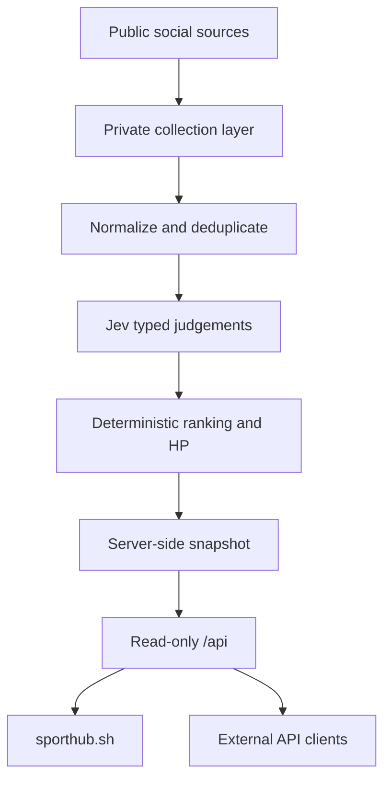

# SportHub architecture

This repository documents the public boundary. The collector, Jev credentials, provider keys, caches and deployment configuration run privately on the SportHub server.

## Public boundary

The API only exposes derived, read-only snapshots. It does not expose provider credentials, Jev prompts, account watchlists, raw caches, refresh controls or server administration.

`GET` requests never call X, Jev or any paid upstream. Collection and evaluation happen on a separate schedule, then the result is published atomically for the site and API clients.

## Product invariants

1. Every signal keeps an original source URL.
2. Publication time and event time remain separate fields.
3. Unknown timing stays unknown.
4. Model confidence is a judgement, not independent confirmation.
5. Missing coverage is never presented as proof of full readiness.
6. A collector or model cannot write through the public API.

## Decision path

Jev answers constrained questions for each source item: which event category applies, which player it concerns and how recent the underlying event appears to be. SportHub then applies source trust, time decay, player role and match proximity. That split keeps the final ordering reproducible and gives each HP change an inspectable explanation.

The public contract is described in [`openapi.yaml`](../openapi.yaml). `/state` mirrors the terminal's current internal view and is marked experimental; `/health`, `/events` and `/matches` are the cleaner integration surfaces.
